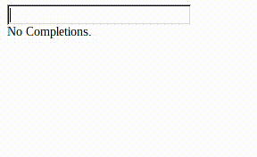

# Input Auto-Complete



1) Create a new Om project using Chestnut

```bash
lein new chestnut auto-complete -- --om-tools --http-kit
```
2) Use your editor of choice to open the file `auto-complete/src/cljs/core.cljs`

3) This namespace will need ``clojure.string`

```clojure
(ns auto-complete.core
  (:require [om.core :as om :include-macros true]
            [om-tools.dom :as dom :include-macros true]
            [om-tools.core :refer-macros [defcomponent]]
            [clojure.string :as cs]))
```

4) Your initial app-state should look like this.

```clojure
(defonce app-state
  (atom {:user-input ""
         :things ["Apple"
                  "ant"
                  "bird"
                  "CAR"
                  "crayon"
                  "cooler"
                  "DVD"
                  "Dirt"
                  "DOG"]}))
```

5) Create a function that will handle the auto-complete logic.

```clojure
(defn partial-complete [x]
  (if-not (empty? x)
    (let [x (cs/lower-case x)
          things (:things @app-state)
          things-lower (map cs/lower-case things)
          things-map (zipmap things things-lower)
          pattern (re-pattern
                   (str "^" x ".*"))
          possible-things (filter #(re-matches pattern (val %))
                                  things-map)]
      (if-let [possible-things (seq possible-things)]
        (map key possible-things)))))
```

6) Create a view that will display the results of the completion function.

```clojure
(defcomponent partial-complete-view [app _]
  (render [_]))
```

7) Add the completion function to the view.

```clojure
(defcomponent partial-complete-view [app _]
  (render
   [_]
   (dom/div
    (if-let [completions (seq
                          (partial-complete (:user-input app)))]
      (for [thing completions]
        (dom/div {} thing))
      "No Completions."))))
```

8) Create a user input view.

```clojure
(defcomponent user-input [app owner]
  (render
   [_]
   (let [ref "user-input"
         k :user-input]
     (dom/input {:ref ref}))))
```

9) Add an onChange JavaScript event. This event should update the application state with `om/update!`.

```clojure
(defcomponent user-input [app owner]
  (render
   [_]
   (let [ref "user-input"
         k :user-input]
     (dom/input {:ref ref
                 :on-change (fn [_]
                              (let [this (om/get-node owner ref)
                                    v (.-value this)]
                                (om/update! app k v)))}))))
```
10) Make a component view that places the user input view above the partial completion view. 

```clojure
(defcomponent auto-complete-view [app _]
  (render
   [_]
   (dom/div
    (om/build user-input app)
    (dom/br {})
    (om/build partial-complete-view app))))
```

11) Replace or alter your main function to display the validation box view.

```clojure
(defn main []
  (om/root
   auto-complete-view
   app-state
   {:target (. js/document (getElementById "app"))}))
```
12) Start a REPL with `lein repl`

```
nREPL server started on port 54879 on host 127.0.0.1 - nrepl://127.0.0.1:54879
REPL-y 0.3.5, nREPL 0.2.6
Clojure 1.6.0
Java HotSpot(TM) 64-Bit Server VM 1.8.0_05-b13
Docs: (doc function-name-here)
(find-doc "part-of-name-here")
Source: (source function-name-here)
Javadoc: (javadoc java-object-or-class-here)
Exit: Control+D or (exit) or (quit)
Results: Stored in vars *1, *2, *3, an exception in *e
```

13) Call `run` to start the back end and compile your ClojureScript.

```
auto-complete.server=> (run)
Starting figwheel.
Starting web server on port 10555 .
#<clojure.lang.AFunction$1@336fc74>
auto-complete.server=> Compiling ClojureScript.
Figwheel: Starting server at http://localhost:3449
Figwheel: Serving files from '(dev-resources|resources)/public'
Compiling "resources/public/js/app.js" from ("src/cljs" "env/dev/cljs")...
Successfully compiled "resources/public/js/app.js" in 18.01 seconds.
notifying browser that file changed:  /js/out/local_state/core.js
```

14) Point your browser to http://localhost:port. You can find the port in the REPL message output =>  `Starting web server on port ...`
