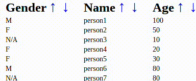

# Single Attribute Sortable Table



1) Create a new Om project using Chestnut

```bash
lein new chestnut sortable-table -- --om-tools --http-kit
```

2) Use your editor of choice to open the file `sortable-table/src/cljs/core.cljs`


3) Your initial app-state should look like this.

```clojure
(defonce app-state 
  (atom
   {:table [{:gender "M" :name "person1" :age 100}
            {:gender "F" :name "person2" :age 50}
            {:gender "N/A" :name "person3" :age 10}
            {:gender "F" :name "person4" :age 20}
            {:gender "F" :name "person5" :age 30}
            {:gender "M" :name "person6" :age 80}
            {:gender "N/A" :name "person7" :age 80}]}))
```

4) Create up and down arrow event logic.

```clojure
(defn sort-by-*! [k]
  (swap! app-state
         update-in
         [:table]
         (fn [table]
           (sort-by k table))))

(defn sort-by-*-reverse! [k]
  (swap! app-state
         update-in
         [:table]
         (fn [table]
           (reverse
            (sort-by k table)))))
```
5) Create a table view header component

```clojure
(defcomponent table-view-header [{:keys [header]} _]
  (render [_]))
```

6) Add TH element to parent the attribute name and sortable arrows.

```clojure
(defcomponent table-view-header [{:keys [header]} _]
  (render
   [_]
   (let [header-name (name header)]
     (dom/th {}
             (clojure.string/capitalize header-name)
             ;; UTF-8 Up Arrow
             (dom/a {} "↑")
             ;; UTF-8 Down Arrow
             (dom/a {} "↓")))))

```

7) Add table view header styles and JavaScript events.

```clojure
(defcomponent table-view-header [{:keys [header]} _]
  (render
   [_]
   (let [header-name (name header)
         header-kw (keyword header-name)
         attr {:href "javascript:void(0);"
               :style {:margin "5px;"
                       :font-size "30px;"
                       :text-decoration "none;"}}
         arrow-down-event (fn [_]
                            (sort-by-*! header-kw))
         arrow-up-event (fn [_]
                          (sort-by-*-reverse! header-kw))
         arrow-up-attr (assoc attr :on-click arrow-up-event)
         arrow-down-attr (assoc attr :on-click arrow-down-event)
         header-attr {:style {:padding-right "20px;"
                              :font-size "25px;"}}]
     (dom/th header-attr
             (clojure.string/capitalize header-name)
             ;; UTF-8 Up Arrow
             (dom/a arrow-up-attr "↑")
             ;; UTF-8 Down Arrow
             (dom/a arrow-down-attr "↓")))))
```

8) Create a table row component

```clojure
(defcomponent table-row [row owner]
  (render 
   [_]
   (dom/tr
    (for [value (map val row)]
      (dom/td value)))))
```

9) Define a function to return all possible headers in the table.

```clojure
(defn header-types []
  (map #(hash-map :header %)
       (-> @app-state
           :table
           first
           keys)))

```

10) Create a component that builds the table's header and rows.

```clojure
(defcomponent table-view [app _]
  (render
   [_]   
   (dom/table
    (dom/tr
     (om/build-all table-view-header
                   (header-types)))
    (om/build-all table-row
                  (:table app)))))
```

11) Replace or alter your main function to display the table view.

```clojure
(defn main []
  (om/root
   table-view
   app-state
   {:target (. js/document (getElementById "app"))}))
```
12) Start a REPL with `lein repl`

```
nREPL server started on port 54879 on host 127.0.0.1 - nrepl://127.0.0.1:54879
REPL-y 0.3.5, nREPL 0.2.6
Clojure 1.6.0
Java HotSpot(TM) 64-Bit Server VM 1.8.0_05-b13
Docs: (doc function-name-here)
(find-doc "part-of-name-here")
Source: (source function-name-here)
Javadoc: (javadoc java-object-or-class-here)
Exit: Control+D or (exit) or (quit)
Results: Stored in vars *1, *2, *3, an exception in *e
```

13) Call `run` to start the back end and compile your ClojureScript.

```
sortable-table.server=> (run)
Starting figwheel.
Starting web server on port 10555 .
#<clojure.lang.AFunction$1@336fc74>
sortable-table.server=> Compiling ClojureScript.
Figwheel: Starting server at http://localhost:3449
Figwheel: Serving files from '(dev-resources|resources)/public'
Compiling "resources/public/js/app.js" from ("src/cljs" "env/dev/cljs")...
Successfully compiled "resources/public/js/app.js" in 18.01 seconds.
notifying browser that file changed:  /js/out/local_state/core.js
```

14) Point your browser to http://localhost:port. You can find the port in the REPL message output =>  `Starting web server on port ...`

